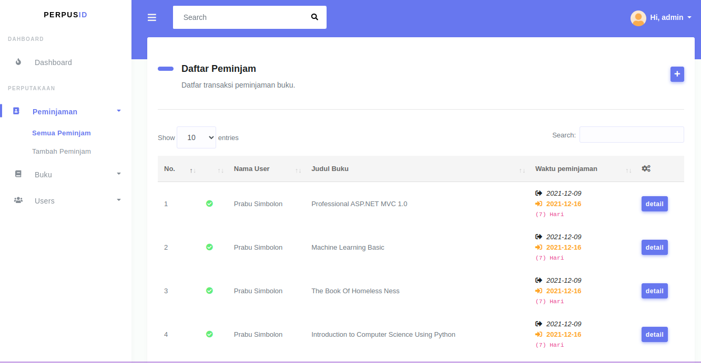
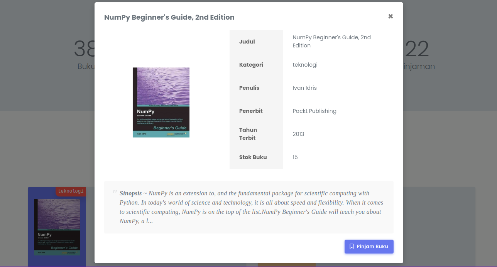

# Perpusid
Perpusid adalah aplikasi perpustakaan berbasis web yang dibuat menggunakan framework CodeIgniter 4 dan Bootstrap stisla. Aplikasi ini dibuat untuk memenuhi tugas akhir mata kuliah Pemrograman Web Lanjut. Aplikasi ini memiliki fitur CRUD (Create, Read, Update, Delete) untuk data buku, anggota, dan peminjaman. Aplikasi ini juga memiliki fitur login dan register untuk admin dan anggota. Admin dapat mengelola data buku, anggota, dan peminjaman. Sedangkan anggota hanya dapat melihat data buku dan melakukan peminjaman buku. 

## Demo
<!-- picture from demo folder to 2 columns -->
| | |
|:-------------------------:|:-------------------------:|
|||

## Requirements
- PHP 8.0 or higher
- Composer
- MySQL

## Installation
1. Clone this repository
2. Run `composer install`
3. Create new database
4. Rename `.env.example` to `.env` and change the database configuration
5. Run `php spark migrate` to migrate the database
6. Run `php spark db:seed AdminSeed` to seed the admin account
7. Run `php spark serve` to run the application